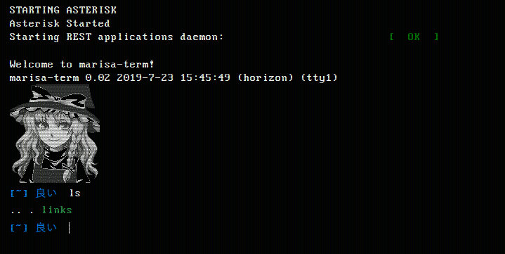

# marisa-term
development  
[live demo](https://tsunagari.space/term)

This is javascript based fake terminal emulator with Flask backend.  




## Detailed functions usage  
* <kbd>ls</kbd> - list directories
* <kbd>cd</kbd> - change directory
* <kbd>groups</kbd> - prints groups
* <kbd>whoami</kbd> - prints who you are
* <kbd>hostname</kbd> - prints hostname  
* <kbd>cat</kbd> - looks for the reference to the String object (if there is any) in hierarchy array, then prints the said string.
  * `cat [file]`
* <kbd>echo</kbd> - displays a line of text.
  * `echo [string]`
  * base64:  
    `echo [string] | base64 [-d]`
  * rot13:  
    `echo [string] | rot13 [-d]`
* <kbd>hextorgb</kbd> - converts hex code to RGB value.
  * `hextorgb #00000`
* <kbd>host</kbd> - returns ip of specified domain. Simulates linux `host` command from `dnsutils`.
  * `host [domain]`
* <kbd>weather</kbd> - returns weather for specified city.
  ```
  weather Destruction Bay
  Weather:
      \  /        Destruction Bay:
   __ /‘‘.-.      TEMP: 12.0°C, broken clouds
      \_(   ).    HUM: 62%  WIND: 5.7 m/s
      /(___(__)   ◓ SUNRISE: 2019-07-27 12:34:28+00
                  ◒ SUNSET: 2019-07-28 06:08:42+00
  ```
* <kbd>encode</kbd> - encodes image's red channel Least Significant Bit and returns link to the encoded image.
  * `encode [message]`
* <kbd>decode</kbd> - decodes image's red channel LSB and returns hidden message.
* <kbd>imgconvert</kbd> - converts picture to specified format.
  * `imgconvert [png|jpg|jpeg|webp|gif]`
* <kbd>help</kbd> - prints help. 
  * `help [command]` gives more detailed help about the command provided.  

## Structure  
`raw.js` - contains 'raw' text data and several variables to use in `term.js`.  
`term.js` - emulator itself. All functions are defined within its body. For everything that can't be done with javascript it makes a POST request to backend server.  

`module_config.py` - contains configurations for python modules like openweathermap.  
`processing.py` - is imported by `routes.py` later, contains actual service functions, e.g `getWeather` or `host`.  

`term.html` - emulator's body. It needs two divs to operate:  
```
      <div id="wrapper">
      <div id="screen">
```  
The rest of html elements is defined in `term.js`.  

```
marisa-term
├── css
│   ├── marisa.css
│   ├── marisa.gif
│   ├── raw.js
│   └── term.js
├── marisa.png
├── README.md
├── server
│   ├── app
│   │   ├── __init__.py
│   │   ├── module_config.py
│   │   ├── processing.py
│   │   └── routes.py
│   └── server.py
└── term.html
```  

## Requisites  
`python3 -m pip install --user flask pyowm Pillow`  

Install gunicorn:  
`sudo apt install gunicorn3`  

Run:  
`gunicorn3 -w 4 -b 0.0.0.0:8050 server:app`  
`-w` - workers;  
`-b` - bind to address:port  

## Creating apache2 reverse proxy for api requests  

Enable apache2 proxy modules:  
`sudo a2enmod proxy proxy_http proxy_balancer lbmethod_byrequests`  

Edit your main website config: add <Location /api> block to it.
```
<VirtualHost *:443>
...
    <Location "/api">
        ProxyPass http://0.0.0.0:8050/api
        ProxyPassReverse http://0.0.0.0:8050/api
    </Location>
...
</VirtualHost>
```  
Now all requests to yourwebsite/api will be forwarded to your Flask application.
